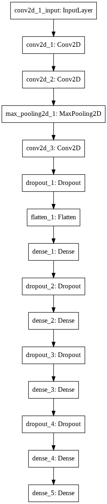
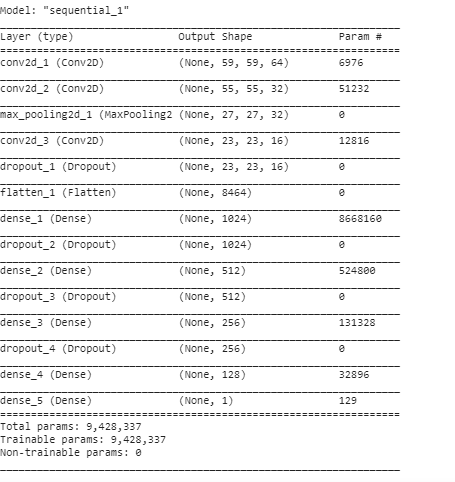

# NNFL Assignment 1

* competition link-https://www.kaggle.com/c/nnfl-assignment-i/

* Task - to classify images into class 1 or 0 based on the training set.
* The model I created: An accuracy of 92.8 was achieved.

  

  

