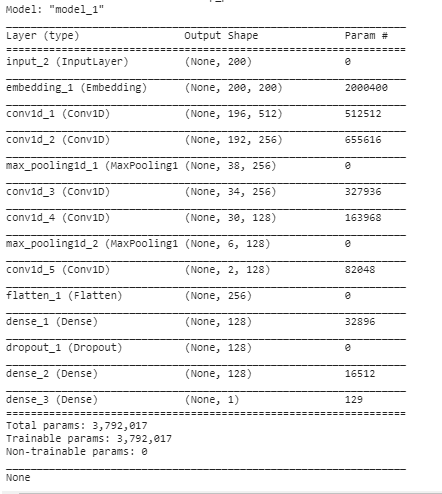
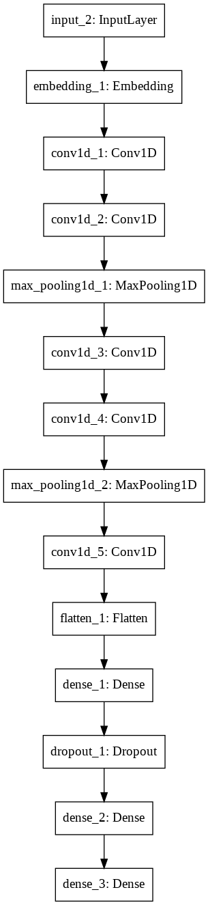

# NNFL Assignment 3

* Competition Link :-https://www.kaggle.com/c/nnfl-assignment-3/

* Task:- Binary classification of text Data Based on the training dataset.

* I Use Word2Vec Pretrained Embeddings to initialize my Embedding.

* Final Accuracy Achieved:-0.858344

  

  